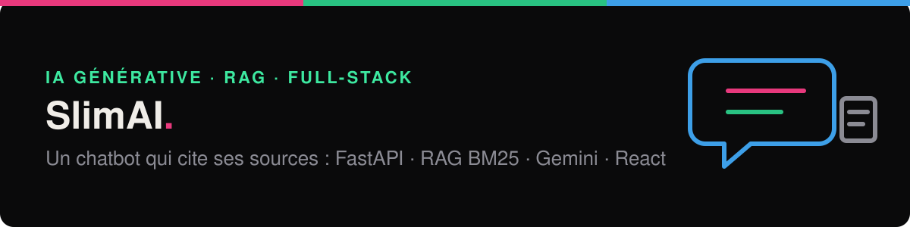
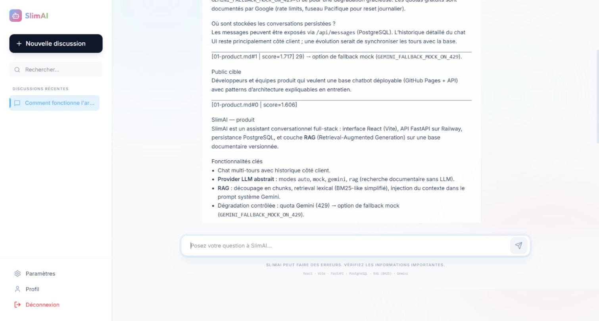
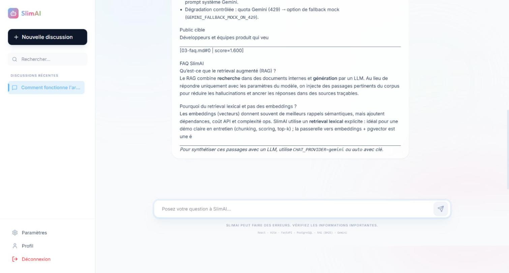
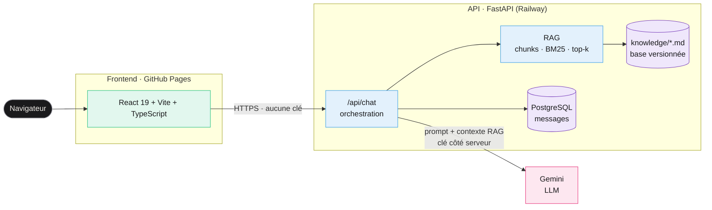
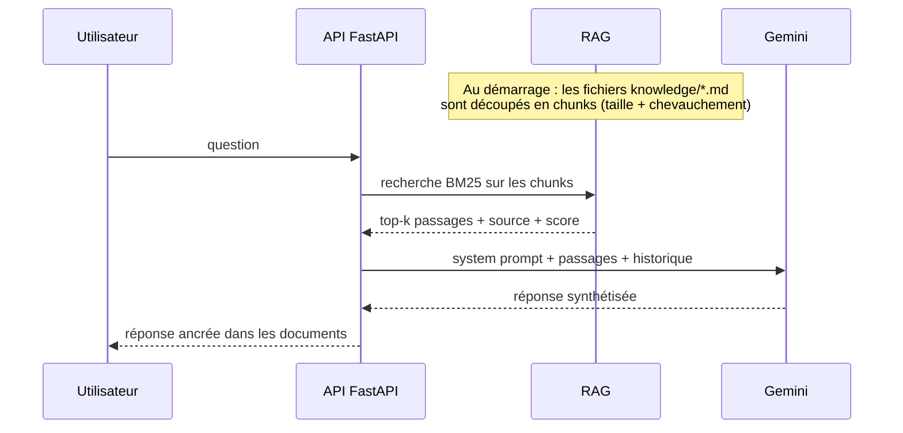

<p align="center">
  
</p>

<p align="center">
  <a href="https://github.com/Salma2002ba/SlimAI-CHAT/actions/workflows/ci.yml"></a>
  
  
  
</p>

<p align="center">
  
  
  
  
  
  
  
  
  
</p>

# SlimAI

Un assistant conversationnel web qui **répond à partir d'une base documentaire et cite ses
sources**. L'API FastAPI orchestre la réponse : elle cherche les passages pertinents dans des
documents Markdown versionnés (RAG), les injecte dans le prompt du LLM Gemini, et garde la clé
d'API **côté serveur uniquement**.

| | |
|---|---|
| **4 modes** de réponse : `auto`, `gemini`, `rag`, `mock` | **RAG** : découpage en chunks, recherche BM25, top-k |
| **Clé Gemini jamais exposée** au navigateur | **13 tests** pytest et **4 jobs** CI à chaque push |
| **Démo sans quota** grâce au mode `rag` (100 % recherche, sans LLM) | Plateforme complète en **une commande** Docker |

## Sommaire

- [Aperçu](#aperçu)
- [Architecture](#architecture)
- [Comment fonctionne le RAG](#comment-fonctionne-le-rag)
- [Les modes de réponse](#les-modes-de-réponse)
- [API](#api)
- [Lancer le projet](#lancer-le-projet)
- [Qualité et CI](#qualité-et-ci)
- [Évolutions possibles](#évolutions-possibles)

---

## Aperçu

<p align="center">
  
</p>

<table>
  <tr>
    <td width="50%"></td>
    <td width="50%"></td>
  </tr>
  <tr>
    <td align="center">Réponse construite à partir de la base documentaire</td>
    <td align="center">Chaque passage est cité avec sa source et son score BM25</td>
  </tr>
</table>

> Captures en mode `rag` (sans clé Gemini), plateforme lancée avec Docker Compose.

## Architecture



**Le choix clé** : le frontend ne parle **qu'à l'API**, jamais à Google. La clé Gemini vit dans
les variables d'environnement du serveur. Un site statique (GitHub Pages) ne peut pas garder de
secret : tout ce qui y est compilé est lisible par n'importe qui.

## Comment fonctionne le RAG

Le RAG (*Retrieval-Augmented Generation*) ancre les réponses du LLM dans des documents de
référence au lieu de le laisser répondre de mémoire, ce qui limite les hallucinations.



**Pourquoi BM25 plutôt que des embeddings** : une recherche lexicale est explicable (on voit le
score de chaque passage), ne demande ni base vectorielle ni appel d'API supplémentaire, et suffit
pour une base documentaire de taille modeste. Le passage aux embeddings (pgvector) est la
prochaine étape naturelle.

Les paramètres se règlent sans toucher au code : `RAG_TOP_K`, `RAG_CHUNK_SIZE`,
`RAG_CHUNK_OVERLAP`, `RAG_KNOWLEDGE_DIR`.

## Les modes de réponse

Un **provider** abstrait le LLM : le même endpoint change de comportement selon
`CHAT_PROVIDER`.

| Mode | Comportement | Usage |
|---|---|---|
| `auto` | Gemini si une clé est présente, sinon `mock` | Par défaut |
| `gemini` | Synthèse par Gemini avec le contexte RAG injecté | Production |
| `rag` | Renvoie directement les passages retrouvés, sans LLM | Démo sans quota, débogage du retrieval |
| `mock` | Réponse simulée | Tests, développement hors ligne |

**Dégradation contrôlée** : avec `GEMINI_FALLBACK_MOCK_ON_429=true`, un dépassement de quota
Gemini (HTTP 429) bascule sur une réponse simulée au lieu d'une erreur.

## API

Documentation OpenAPI générée automatiquement sur `/docs`.

| Méthode | Route | Rôle |
|---|---|---|
| `GET` | `/health` | Santé de l'API |
| `GET` | `/db-health` | Connexion à PostgreSQL (503 si la base n'est pas configurée) |
| `POST` | `/api/chat` | Conversation multi-tours, avec RAG |
| `GET` | `/api/rag/stats` | Nombre de chunks et fichiers sources indexés |
| `GET` | `/api/rag/search?q=...` | Passages retrouvés, avec leur score BM25 |
| `GET` / `POST` | `/api/messages` | Messages persistés en base |

## Lancer le projet

Prérequis : Docker avec Docker Compose.

```bash
cp .env.example .env            # ajouter GEMINI_API_KEY pour le mode gemini (facultatif)
docker compose up -d --build --wait
```

| Service | Adresse |
|---|---|
| Interface | http://localhost:8080 |
| API | http://localhost:8000 · Swagger : http://localhost:8000/docs |

Sans clé Gemini, lancer en mode recherche seule :

```bash
CHAT_PROVIDER=rag docker compose up -d --build --wait
```

<details>
<summary>Sans Docker (développement)</summary>

```bash
# API
cd backend
python -m venv .venv && source .venv/bin/activate
pip install -r requirements.txt
uvicorn app.main:app --reload

# Interface
cd frontend
npm install
VITE_API_BASE_URL=http://localhost:8000 npm run dev
```

</details>

**Déploiement** : l'API tourne sur Railway avec sa base PostgreSQL, l'interface est publiée sur
GitHub Pages par le workflow [`deploy-pages.yml`](.github/workflows/deploy-pages.yml), qui
injecte l'URL publique de l'API au build (`VITE_API_BASE_URL`).

## Qualité et CI

À chaque push, GitHub Actions lance :

| Job | Ce qu'il vérifie |
|---|---|
| Backend | Les 13 tests pytest (santé, chat, messages, RAG, configuration) et le build de l'image Docker |
| Frontend | Vérification TypeScript, build Vite et build de l'image Docker |
| Structure | Présence des dossiers attendus et validité du `docker-compose.yml` |
| Sécurité | **Gitleaks** sur tout l'historique Git, **Trivy** sur les dépendances (rapport) |

Le jeton GitHub du pipeline n'a que le droit de lecture (`permissions: contents: read`).

## Évolutions possibles

- Embeddings et base vectorielle (**pgvector**) pour une recherche sémantique.
- Reranking des passages avant l'envoi au LLM.
- Authentification et quotas par utilisateur côté API.
- Ingestion de PDF et de pages web pour enrichir la base documentaire.
- Historique des conversations synchronisé en base.

## Structure du dépôt

```text
.
├── backend/
│   ├── app/api/routes/     health, chat, messages, rag
│   ├── app/services/rag/   ingestion (chunking), retrieval (BM25), pipeline
│   ├── app/services/llm.py Appel Gemini et modes de réponse
│   ├── knowledge/          Base documentaire Markdown indexée par le RAG
│   └── tests/              13 tests pytest
├── frontend/               React 19 + Vite + TypeScript, servi par Nginx en conteneur
├── docs/                   Architecture et choix techniques
├── docker-compose.yml      Interface + API + PostgreSQL
└── .github/workflows/      CI et déploiement GitHub Pages
```

---

<p align="center">
  <b>Salma Baba</b> · Ingénieure DevOps & DevSecOps ·
  <a href="https://salmababa.com">salmababa.com</a>
</p>
