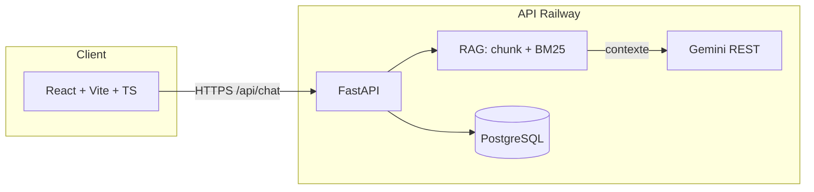

# SlimAI — stack & pitch entretien

Projet **full-stack** volontairement **explicable** : on peut décrire chaque couche sans magie.

## Architecture

## Buzzwords → où ça vit dans le repo

| Concept | Implémentation |
|--------|------------------|
| **LLM orchestration** | `backend/app/api/routes/chat.py` + `services/llm.py` |
| **Provider pattern** | `CHAT_PROVIDER`: `auto`, `mock`, `gemini`, `rag` (`config.py`) |
| **RAG** | Corpus `backend/knowledge/*.md`, chunking `services/rag/ingest.py`, retrieval BM25 `services/rag/retrieve.py`, injection prompt `run_gemini_chat` |
| **Retrieval-Augmented Generation** | Contexte RAG concaténé au **system prompt** Gemini (pas seulement au dernier tour user) |
| **Dégradation contrôlée** | `GEMINI_FALLBACK_MOCK_ON_429`, mode `mock`, mode `rag` sans quota |
| **API REST** | OpenAPI auto : `/docs`, `/api/rag/stats`, `/api/rag/search` |
| **Persistance** | SQLAlchemy + Postgres, `messages`, `create_all` au lifespan |
| **Sécurité** | Clé Gemini **uniquement** serveur ; front = `VITE_API_BASE_URL` |
| **CI/CD** | GitHub Actions : pytest, Docker, `docker compose config` ; Pages avec `VITE_API_BASE_URL` |

## Phrase d’accroche (30 s)

> « SlimAI est un chatbot web dont le backend FastAPI abstrait le LLM : RAG lexical sur Markdown versionné, augmentation de prompt Gemini, et modes mock / RAG-only pour démo sans quota. Le front Vite parle uniquement à mon API, jamais à Google avec la clé. »

## Démonstration rapide

1. `GET /api/rag/stats` — nombre de chunks, fichiers sources.  
2. `GET /api/rag/search?q=RAG` — scores BM25 + extraits.  
3. `POST /api/chat` avec `CHAT_PROVIDER=rag` — réponse 100 % retrieval.  
4. `CHAT_PROVIDER=gemini` + clé — synthèse avec contexte injecté.

## Évolutions crédibles (si on te demande la suite)

- Embeddings + **pgvector** / autre vector store.  
- **LangChain / LlamaIndex** pour chaîner retrieval + rerank.  
- Auth + quotas par utilisateur côté API.  
- Ingestion PDF / webhook pour enrichir `knowledge/`.
